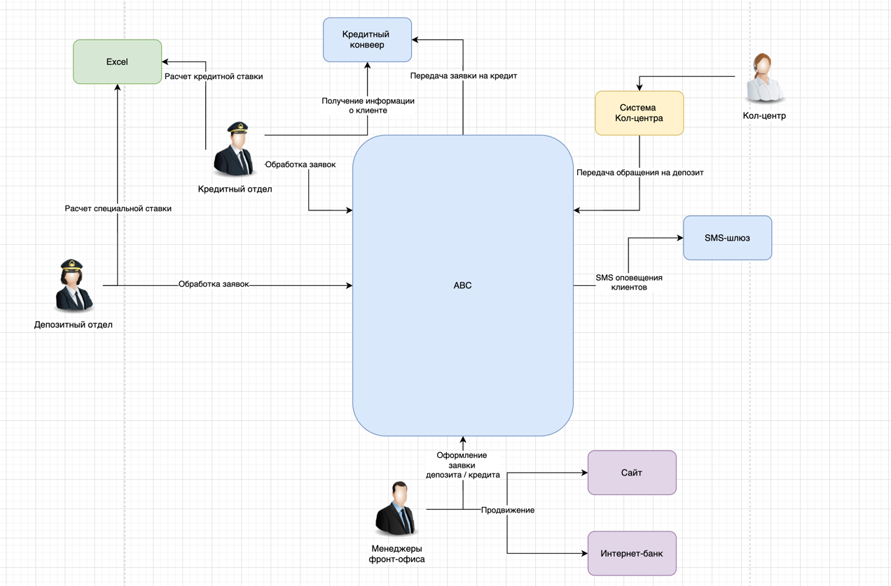

# Карта текущего IT-ландшафта (as-is)

| Оргструктура                                  | Продажи в сети отделений | Продажи через кол-центр | Digital-оповещения клиентов | Обслуживание депозитных процессов | Обслуживание кредитных процессов | Управление договорами |
|-----------------------------------------------|--------------------------|-------------------------|-----------------------------|-----------------------------------|----------------------------------|-----------------------|
| Управление обслуживанием в сети отделений     | АБС                      | —                       | —                           | АБС                               | АБС                              | АБС                   |
| Кол-центр                                     | —                        | Система кол-центра      | SMS-шлюз                    | —                                 | АБС                              | —                     |
| IT-отдел                                      | АБС, интернет-банк, сайт | Система кол-центра      | SMS-шлюз                    | АБС                               | АБС, Кредитный конвейер, Скоринг | АБС                   |
| Управление обслуживанием депозитных продуктов | —                        | —                       | —                           | АБС, Excel                        | —                                | —                     |
| Управление обслуживанием кредитных продуктов  | —                        | —                       | —                           | Excel, АБС                        | АБС, Кредитный конвейер          | —                     |
| Команда цифровой трансформации                | —                        | —                       | —                           | —                                 | —                                | —                     |

---

## Пояснения к заполненным ячейкам

### Управление обслуживанием в сети отделений

- **АБС (продажи в отделениях)** — основной инструмент фронт-офиса для оформления заявок на депозиты и кредиты.
- **АБС (обслуживание депозитов)** — оформление депозитов, фиксация ставок, загрузка подписанных документов.
- **АБС (обслуживание кредитов)** — регистрация кредитных заявок от клиентов.
- **АБС (управление договорами)** — хранение всех договоров по депозитам и кредитам.

### Кол-центр

- **Система кол-центра (продажи через кол-центр)** — CRM-платформа подрядчика для фиксации обращений и заявок,
  интеграция с АБС.
- **SMS-шлюз (digital-оповещения)** — отправка клиентам уведомлений о ставках и статусах заявок.
- **АБС (обслуживание кредитов)** — при оформлении заявки на кредит через кол-центр данные вносятся в АБС.

### IT-отдел

- **АБС, интернет-банк, сайт (продажи в отделениях)** — поддержка и сопровождение систем для стабильной работы каналов
  продаж.
- **Система кол-центра (продажи через кол-центр)** — поддержка интеграций и работы CRM-платформы.
- **SMS-шлюз (digital-оповещения)** — администрирование шлюза и взаимодействие с телеком-оператором.
- **АБС (обслуживание депозитов)** — сопровождение операций по открытию депозитов.
- **АБС, Кредитный конвейер, Скоринг (обслуживание кредитов)** — поддержка интеграций, выгрузка заявок из АБС в
  Кредитный конвейер, обмен данными со Скорингом и БКИ.
- **АБС (управление договорами)** — обеспечение доступности и сохранности договоров.

### Управление обслуживанием депозитных продуктов

- **АБС (обслуживание депозитов)** — внесение ставок, полученных от кредитного отдела, и оформление депозитов в системе.
- **Excel (обслуживание депозитов)** — для расчёта спецставок на основе данных от кредитного отдела.

### Управление обслуживанием кредитных продуктов

- **Excel (обслуживание депозитов)** — ведение основного файла ставок по депозитам: расчёт на основе ставки ЦБ, текущих
  кредитов/депозитов и уровня кредитного риска.  
  Передача файла в бэк-офис депозитов по email.
- **АБС (обслуживание депозитов)** — анализ кредитного риска клиента в своём разделе АБС для расчёта спецставок.
- **АБС, Кредитный конвейер (обслуживание кредитов)** — оформление кредитных заявок, обработка в Кредитном конвейере,
  получение решения и возврат данных в АБС.

# Схема интеграции приложений

IT-отдел не был включен в данную схему, так как он сопровождает все системы

# [Draw.io схемы](Task_1.drawio)