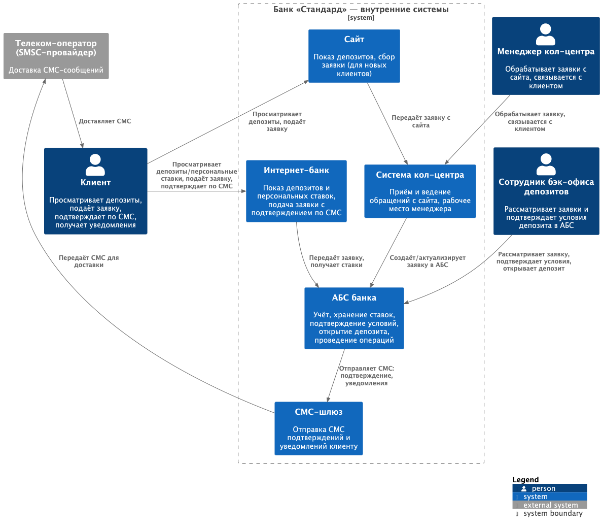
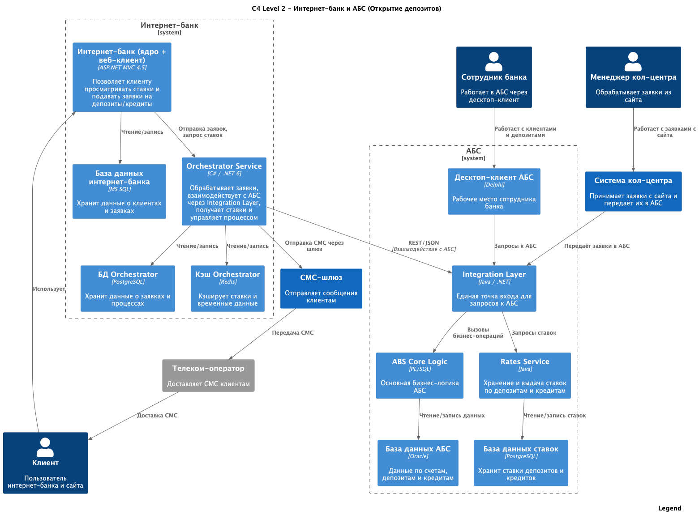

### **Название задачи:**

ADR-2025-01: Концептуальная архитектура открытия депозитов онлайн (MVP)

### **Автор:**

Султанов Д.Л.

### **Дата:**

2025-08-12

---

### **Функциональные требования**

|   № | Действующее лицо / система                                            | Use Case                                     | Описание                                                                                                                                                                                                                                                                                                       |
|----:|-----------------------------------------------------------------------|----------------------------------------------|----------------------------------------------------------------------------------------------------------------------------------------------------------------------------------------------------------------------------------------------------------------------------------------------------------------|
| UC1 | Клиент, Сайт                                                          | Просмотр депозитов на сайте                  | 1. Клиент открывает сайт. 2. Система отображает список доступных депозитов с актуальными ставками.                                                                                                                                                                                                          |
| UC2 | Клиент, Сайт, Кол-центр, АБС                                          | Подача заявки на депозит через сайт          | 1. Клиент заполняет ФИО и телефон, отправляет заявку. 2. Заявка уходит в систему кол-центра. 3. Менеджер кол-центра связывается с клиентом и фиксирует условия. 4. При необходимости данные передаются в АБС для расчёта/подтверждения условий. 5. Сохраняется сквозное ведение заявки в системах. |
| UC3 | Клиент, Интернет-банк, СМС-шлюз, АБС                                  | Просмотр депозитов в интернет-банке          | 1. Клиент авторизуется в интернет-банке. 2. Система отображает список доступных депозитов и персонализированные ставки, полученные из АБС.                                                                                                                                                                  |
| UC4 | Клиент, Интернет-банк, СМС-шлюз, АБС                                  | Подача заявки на депозит через интернет-банк | 1. Клиент выбирает депозит, указывает счёт и сумму. 2. ИБ отправляет СМС-код подтверждения. 3. Клиент вводит код. 4. Заявка передаётся в АБС для подтверждения условий. 5. Клиент получает СМС о подтверждении ставки и открытии депозита.                                                         |
| UC5 | Бэк-офис депозитов/кредитов, Отдел кредитования, Система ставок (АБС) | Управление ставками                          | 1. Сотрудники ведут ставки в централизованной системе. 2. При необходимости запрашивают данные у кредитного отдела для расчёта спецставки. 3. Фиксируют изменения ставок в системе.                                                                                                                      |

---

### **Нефункциональные требования**

| **№** | **Требование**                                                                                                                                                                                |
|:-----:|:----------------------------------------------------------------------------------------------------------------------------------------------------------------------------------------------|
|   1   | **R:** Надёжная доставка СМС-уведомлений по депозитам (подтверждение ставки и факта открытия) через существующую СМС-инфраструктуру.                                                          |
|   2   | **P:** Время отклика пользовательских операций по депозитам — в пределах миллисекунд (просмотр списка/ставок, подача заявки).                                                                 |
|   3   | **P:** Устранить задержки более 1 секунды при загрузке справочных/каталожных данных, влияющих на страницы депозитов.                                                                          |
|   4   | **P:** Сократить длительность процесса согласования и открытия депозита (с текущих 20–60 минут — до минимально возможного в рамках MVP).                                                      |
|   5   | **P:** Интернет-банк должен поддерживать горизонтальное масштабирование для выдерживания требуемой производительности по депозитным операциям.                                                |
|   6   | **+**: Передача всех данных по депозитам на сайте и в интернет-банке — только по защищённым каналам (TLS/HTTPS).                                                                              |
|   7   | **+**: Избегать прямых вызовов интернет-банка к API АБС в депозитном процессе; использовать прослойку/буфер, чтобы не увеличивать нагрузку на БД АБС (АБС масштабируется только вертикально). |
|   8   | **+**: Использовать уже имеющиеся в банке технологии и стэк (MS SQL, Oracle; новые — только совместимые и с существующей экспертизой).                                                        |
|   9   | **+**: Разделение доступа между сотрудниками депозитов и кредитов при работе со ставками и заявками (соответствие требованиям безопасности).                                                  |
|  10   | **+**: Централизованное логирование ключевых действий по депозитам (подача заявки, изменение/подтверждение ставки, открытие депозита) с возможностью поиска по идентификатору запроса.        |
|  11   | **+**: Мониторинг метрик скорости, доступности и ошибок по всем узлам депозитной цепочки (сайт, интернет-банк, интеграции, АБС, СМС) с оповещениями при отклонениях.                          |
|  12   | **+**: Использовать существующую СМС-инфраструктуру ядра банка для подтверждений и уведомлений по депозитам, без доработок у подрядчика.                                                      |

---

### **Решение**

#### **C4 Model – Level 1 (Контекст)**

#### **C4 Model – Level 2 (Контейнеры)**

#### Обоснование архитектурного решения: вынос сервисов

##### 1. Ограничения существующих систем
- **Интернет-банк** — монолит подрядчика на ASP.NET MVC 4.5, обновление ядра привязано к внешнему вендору.  
  ➡️ Любые изменения в бизнес-логике, особенно требующие модификации ядра, будут дорогими и долгими.
- **АБС** — монолит на Delphi + PL/SQL с вертикальным масштабированием, плохо адаптируется к росту нагрузки.  
  ➡️ Прямое добавление новой логики увеличит нагрузку на уже загруженную базу Oracle и снизит доступность.

##### 2. Разделение нагрузки
- Вынос новых функций в отдельные **микросервисы** позволяет:
  - перераспределить нагрузку между компонентами;
  - обрабатывать заявки и вычислять ставки без влияния на производительность основной АБС;
  - кэшировать часто запрашиваемые данные (например, ставки) в Redis для ускорения отклика.

##### 3. Гибкость разработки
- Микросервисы находятся **под полным контролем команды банка**, без зависимости от подрядчика интернет-банка или разработчиков АБС.
- Возможность использовать **современный стек** (C#/.NET 6, Java, PostgreSQL, Redis) и практики CI/CD, не затрагивая устаревшие платформы.

##### 4. Единая точка интеграции
- **Integration Layer** внутри АБС позволяет:
  - централизовать маршрутизацию запросов;
  - разграничивать доступ (Core Logic и Rates Service не доступны напрямую);
  - упростить аудит и мониторинг интеграций.

##### 5. Повышение отказоустойчивости
- При сбоях в АБС или интернет-банке оркестратор заявок может работать автономно, временно сохраняя заявки в своей БД и отправляя их в АБС при восстановлении связи.
- Кэширование ставок снижает зависимость от скорости отклика АБС.

##### 6. Унификация для депозитов и кредитов
- **Rates Service** — единый источник правды по ставкам для двух направлений (депозиты и кредиты).
- Минимизируется дублирование логики и упрощается сопровождение.

---

### **Альтернативы**

#### 1. Внедрение новой логики прямо в ядро интернет-банка
**Описание:**  
Добавить модули для работы со ставками, заявками и СМС прямо в существующий монолит интернет-банка подрядчика.

**Недостатки:**
- Зависимость от подрядчика при любом изменении ядра.
- Высокая стоимость и длительные сроки внедрения.
- Риск замедления всей системы при росте нагрузки.
- Невозможность быстрого отката изменений.

---

#### 2. Внедрение новой логики прямо в АБС
**Описание:**  
Разработка функционала ставок и обработки заявок на Delphi/PL-SQL внутри монолита АБС.

**Недостатки:**
- Увеличение нагрузки на уже перегруженную Oracle БД.
- Ограничения масштабирования — только вертикально.
- Усложнение сопровождения из-за монолитной архитектуры.
- Высокая стоимость изменений и риски влияния на критичные банковские операции.

---

#### 3. Использование внешней шины данных (ESB) или интеграционной платформы
**Описание:**  
Развертывание ESB, через которую проходили бы все запросы между интернет-банком, АБС, СМС-шлюзом и будущими сервисами.

**Недостатки:**
- Существенные затраты на внедрение и сопровождение.
- Увеличение точки отказа — при падении шины останавливается весь обмен.
- Избыточно для задачи открытия депозитов и кредитов в рамках MVP.

---

#### 4. Замена интернет-банка или АБС на более гибкие платформы
**Описание:**  
Миграция на современную модульную систему интернет-банка или АБС с поддержкой микросервисов.

**Недостатки:**
- Проект на 1–2 года и с высоким бюджетом.
- Серьёзные организационные изменения.
- Не решает задачу MVP в сжатые сроки.

---

#### 5. Использование единой общей БД для интернет-банка и АБС
**Описание:**  
Хранение ставок и заявок в одной общей БД, доступной обоим системам напрямую.

**Недостатки:**
- Риски прямого вмешательства в данные.
- Сложность в разграничении прав доступа.
- Высокая зависимость между системами — сбой в одной может повлиять на другую.
- Противоречит требованиям безопасности.

---

### **Недостатки, ограничения и риски**

#### Недостатки
- Появляется дополнительный слой сервисов, что увеличивает количество компонентов для сопровождения.
- Требуется интеграция с устаревшими системами (интернет-банк и АБС), что может усложнить разработку и тестирование.
- Необходимость реализации и поддержки собственных API между сервисами и существующими системами.
- Возможны дублирующие хранилища данных (например, кэш в Redis и основная БД), что потребует синхронизации.

#### Ограничения
- Интернет-банк остаётся на платформе подрядчика, что не позволяет менять его ядро и накладывает ограничения на глубину интеграции.
- АБС сохраняет вертикальное масштабирование и архитектурные ограничения монолита.
- Доступность и производительность сервисов частично зависят от стабильности работы интернет-банка и АБС.
- SMS-шлюз остаётся «чёрным ящиком» — возможны ограничения по форматам и скорости отправки сообщений.
- MVP предполагает минимальные изменения в существующих процессах бэк-офиса, что ограничивает уровень автоматизации.

#### Риски
- Риск увеличения времени отклика из-за дополнительных hops между сервисами и системами.
- Риск отказа интеграции при изменениях API интернет-банка или АБС.
- Риск несоответствия данных при задержках репликации или обновления кэша.
- Риск недооценки нагрузки на новые сервисы при масштабировании клиентской базы.
- Риск роста технического долга, если временные решения MVP будут использоваться как постоянные.
