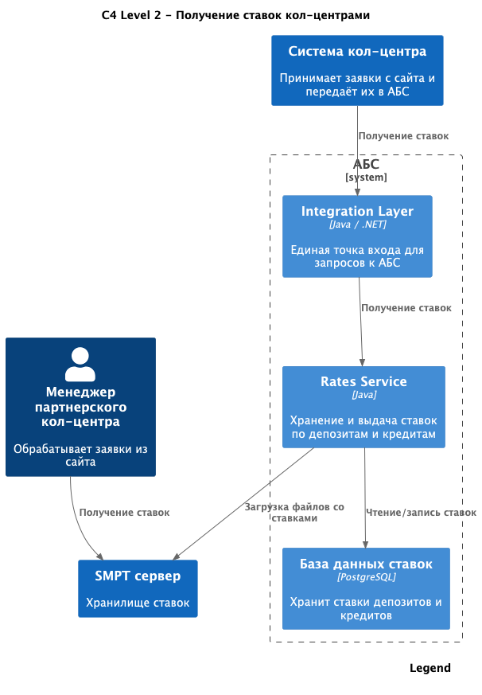

### **Название задачи:**

Обеспечение доступа внутреннего и партнёрского кол-центров к актуальным ставкам депозитов в рамках MVP

### **Автор:**

Султанов Д.Л.

### **Дата:**

15.08.2025

---

### **Функциональные требования**

| **№** | **Действующие лица или системы**  | **Use Case**                               | **Описание**                                                                                                                                                                                                       |
|:-----:|:----------------------------------|:-------------------------------------------|:-------------------------------------------------------------------------------------------------------------------------------------------------------------------------------------------------------------------|
|  F1   | Сотрудник внутреннего кол-центра  | Получение информации по текущим ставкам    | Сотрудник внутреннего кол-центра может получить через свою систему актуальные ставки по депозитам, чтобы проконсультировать клиента по телефону. Данные должны поступать в систему кол-центра из Rates Service. |
|  F2   | Сотрудник партнёрского кол-центра | Получение информации по текущим ставкам    | Сотрудник партнёрского кол-центра может получить файл (CSV/XLSX) с актуальными ставками по депозитам для консультации клиентов. Файл предоставляется банком через защищённый канал передачи файлов (SFTP).      |
|  F3   | Rates Service                     | Экспорт ставок для партнёрского кол-центра | Сервис ставок должен формировать и обновлять файл с актуальными депозитными ставками в формате, согласованном с партнёром, и выгружать его на SFTP-сервер в определённом расписании.                               |
|  F4   | Клиент банка                      | Получение консультации по телефону         | Клиент может позвонить в кол-центр банка или партнёрский кол-центр и получить актуальную информацию по депозитным ставкам.                                                                                         |

---

### **Нефункциональные требования**

| **№** | **Требование**                                                                                                                                                                                                                                                                                           |
|:-----:|:---------------------------------------------------------------------------------------------------------------------------------------------------------------------------------------------------------------------------------------------------------------------------------------------------------|
|  N1   | Передача ставок должна выполняться по защищённому каналу (SFTP).                                                                                                                                                                                                                                         |
|  N2   | Формат выгружаемых файлов должен быть читаемым для партнёрского кол-центра (CSV или XLSX).                                                                                                                                                                                                               |
|  N3   | Частота обновления файлов должна обеспечивать актуальность данных для консультирования (например, не реже 1 раза в час в рабочее время).                                                                                                                                                                 |
|  N4   | Доступ к SFTP-серверу должен быть ограничен только авторизованным пользователям партнёрского кол-центра.                                                                                                                                                                                                 |
|  N5   | Передача ставок во внутренний кол-центр должна происходить онлайн через интеграцию с Rates Service.                                                                                                                                                                                                      |
|  N6   | Логирование всех операций выгрузки и передачи ставок для аудита.                                                                                                                                                                                                                                         |
|  N7   | Мониторинг успешности передачи файлов партнёру.                                                                                                                                                                                                                                                          |
|  N8   | 💬 **Комментарий:** Партнёрский кол-центр не имеет возможности интеграции через API (в понимании REST/gRPC). Вместо этого используется протокол передачи файлов **SFTP** — это не API, а канал доставки, позволяющий передавать подготовленные файлы (например, CSV, XLSX) через защищённое подключение. |

---

### **Решение**

#### **Диаграмма контекста (C4 — Context)**

Не нужна, смотреть Диаграмма контейнеров (C4 — Containers)

---

#### **Диаграмма контейнеров (C4 — Containers)**

---

**Обоснование выбора решения:**

- Используем уже спроектированный **Rates Service** для получения актуальных ставок в одном месте.
- Для внутреннего кол-центра — онлайн-доступ через REST API.
- Для партнёрского кол-центра — формирование файла и передача по SFTP, так как у них нет API-доступа.
- Логирование и мониторинг выгрузки обеспечивают контроль процесса.

---

### **Альтернативы**

1. **Раздавать ставки партнёру через API**  
   ❌ Отпадает, т.к. партнёрский кол-центр не имеет возможности интеграции через API.

2. **Передавать ставки по e-mail**  
   ❌ Ненадёжно, сложно автоматизировать, нет гарантии доставки, возможны утечки данных.

3. **Обмен через общий облачный диск (Google Drive, Dropbox)**  
   ❌ Несоответствие требованиям безопасности банка, отсутствие полной автоматизации.

---

### **Недостатки, ограничения, риски**

- Необходимость поддержки SFTP-сервера и прав доступа.
- Партнёрский кол-центр будет иметь данные с небольшой задержкой (в зависимости от частоты выгрузки).
- Возможны проблемы при передаче файлов (сетевые сбои, ошибки авторизации) — требуется мониторинг и оповещения.
- Дополнительная нагрузка на Rates Service при формировании и выгрузке файлов.

---

### **Примечание для ревьюера**
Данное ADR сделано обособленно от [ADR-2025-01.md](../Task3/ADR-2025-01.md).

Но по сути в том ADR будет реализован сервис котировок, в который нужно только прикрутить 
- формирование файла и отправку залитие его на сервер
- и также доработеть интеграцию системы кол-центра с Integration Layer для получения котировок

Поэтому лучше делать последовательно два этих решения, тем более это проблема выстрелит, только при запуске MVP и нет спешки делать ее раньше.
