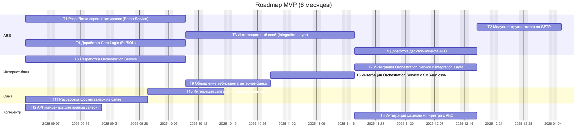

## Список крупных задач по системам

**ABS**
- **T1** – Разработка сервиса котировок (Rates Service)
- **T2** – Модуль выгрузки ставок на SFTP для партнёрского кол-центра
- **T3** – Интеграционный слой (Integration Layer) для обращения к Rates Service и Core Logic
- **T4** – Доработка Core Logic (PL/SQL): пакеты Deposits_API (create/confirm/open), идемпотентность, статусы, аудит
- **T5** – Доработка десктоп-клиента АБС: работа только через Integration Layer (получение ставок/операций)

**Интернет-банк**
- **T6** – Разработка Orchestration Service для обработки заявок на депозиты и кредиты
- **T7** – Интеграция Orchestration Service с Integration Layer АБС
- **T8** – Интеграция Orchestration Service с SMS-шлюзом
- **T9** – Обновление веб-клиента интернет-банка под новый поток (заявка, OTP, статусы)

**Сайт**
- **T10** – Интеграция сайта с системой кол-центра для подачи заявок
- **T11** – Разработка формы заявок на сайте с отправкой данных в кол-центр

**Кол-центр**
- **T12** – API кол-центра для приёма заявок с сайта
- **T13** – Интеграция системы кол-центра с АБС через Integration Layer

## Roadmap MVP (6 месяцев)

**Примечания:**
- Сделано в mermaid, потому что это лучше подходит к изменениям
