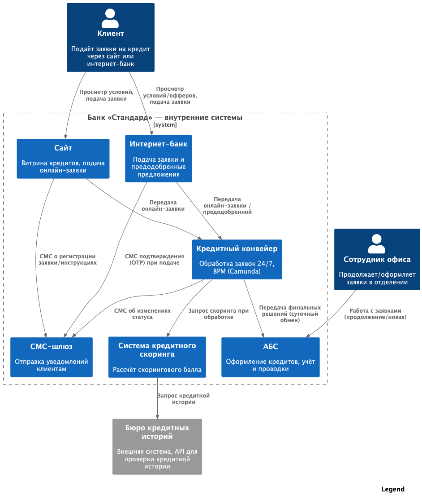
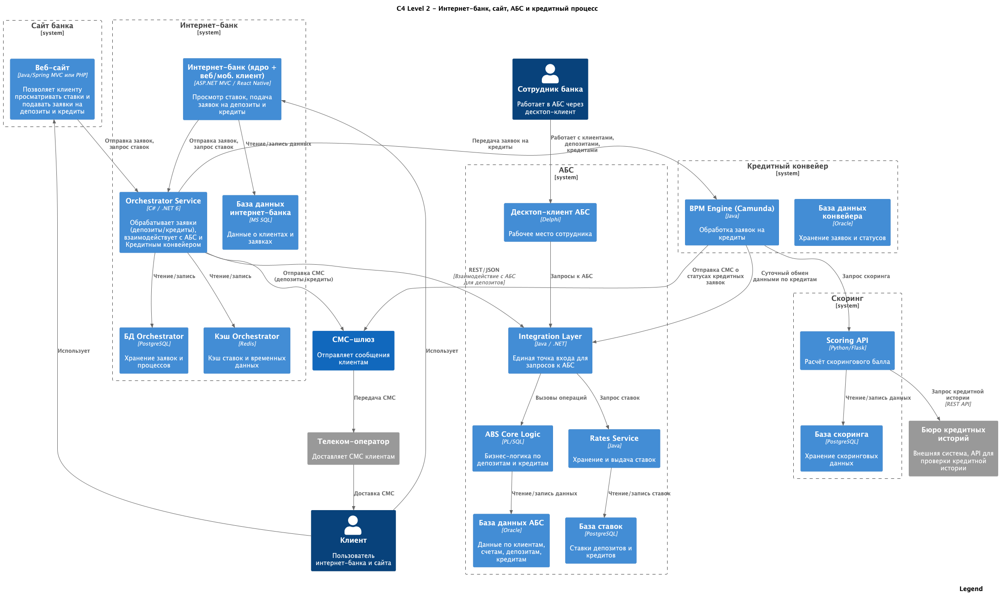

### **Название задачи:**

Онлайн-подача заявки на кредит (сайт и интернет-банк) и обработка предодобренных предложений

### **Автор:**

Султанов Д.Л.

### **Дата:**

16.08.2025

---

### **Функциональные требования**

| **№** | **Действующие лица или системы** | **Use Case** | **Описание** |
|:---:|:---|:---|:---|
| **F1** | Клиент, Сайт, Кредитный конвейер, Система кредитного скоринга, SMS-шлюз | Подача заявки через сайт | 1. Клиент заполняет форму заявки на сайте, указывая ФИО, телефон и при желании паспортные данные. 2. Если паспортные данные указаны, сайт передает их в кредитный конвейер и систему скоринга для расчёта предварительного решения. 3. Клиент получает СМС с приглашением прийти в отделение для идентификации и получения кредита. |
| **F2** | Клиент, Сотрудник офиса, АБС, Кредитный конвейер | Продолжение ранее поданной заявки в отделении | 1. Сотрудник офиса находит в АБС заявку клиента, ранее поданную через сайт, или создает новую, если клиент не подавал заявку. 2. Заявка передается в кредитный конвейер для обработки. 3. После подтверждения условий кредит оформляется в АБС. |
| **F3** | Клиент, Сотрудник офиса, АБС, Кредитный конвейер | Подача новой заявки в отделении | 1. Сотрудник банка оформляет новую заявку клиента в АБС. 2. Заявка передается в кредитный конвейер. 3. После одобрения кредита в конвейере данные возвращаются в АБС, кредит оформляется. |
| **F4** | Клиент, Интернет-банк, Кредитный конвейер, Система кредитного скоринга, SMS-шлюз | Подача предодобренной заявки через интернет-банк | 1. Клиент получает уведомление в интернет-банке о предодобренном кредите с предварительными условиями. 2. Клиент выбирает счёт зачисления и подтверждает заявку СМС-кодом. 3. Заявка передается в кредитный конвейер и при необходимости в систему скоринга для пересчета. 4. После одобрения кредит оформляется в АБС. |
| **F5** | Кредитный конвейер, SMS-шлюз, Клиент | Информирование клиента о статусе заявки | 1. Кредитный конвейер обновляет статус заявки. 2. При изменении статуса формируется уведомление. 3. SMS-шлюз отправляет клиенту сообщение о новом статусе. |

---

### **Нефункциональные требования**

| **№** | **Требование**                                                                                                                       |
|:-----:|:-------------------------------------------------------------------------------------------------------------------------------------|
|  N1   | Время отклика витрин (списки продуктов/офферов) — милисекунды; тяжёлые операции (скоринг, запись в Конвейер) выполняются асинхронно. |
|  N2   | Интернет-банк не обращается напрямую к АБС; только через Оркестратор/Integration Layer.                                              |
|  N3   | Доступность онлайн-канала ≥99.9%; горизонтальное масштабирование Оркестратора; без простоев при сбоях одного ЦОД.                    |
|  N4   | Не нагружать скоринг предрасчётами; вызывать только по событию подачи/повторной проверки (упрощённый path для предодобренных).       |
|  N5   | Идемпотентность приёма заявок и вызовов в внешние системы (по request_id).                                                           |
|  N6   | Логирование ключевых событий (создание/скоринг/решение/СМС), метрики RPS/latency/errors; алерты на сбои интеграций.                  |
|  N7   | Безопасность: TLS между всеми звеньями; хранение ПДн по принципу минимизации; доступы по ролям; маскирование в логах.                |
|  N8   | Сохранение текущего суточного обмена АБС↔Конвейер (невозможно ускорить).                                                             |
|  N9   | UX-стрим: мгновенная приёмка и статусы «принято/в обработке»; долгие шаги — фоновые.                                                 |

---

### **Решение**

#### **C4 Model – Level 1 (Контекст)**

#### **C4 Model – Level 2 (Контейнеры)**

#### Обоснование решения

- **Онлайн-подача через Orchestrator, обработка в Кредитном конвейере.**  
  Конвейер (Camunda) уже рассчитан на 24/7, горизонтально масштабируется и содержит бизнес-процессы кредитования; это снимает нагрузку с перегруженной АБС и выполняет требование обрабатывать предодобренные заявки «в тот же день».  
- **Суточный обмен Конвейер ↔ АБС сохраняется.**  
  Это текущее ограничение банка: ускорение обмена «базами» невозможно. Мы принимаем его как данность и проектируем процесс так, чтобы пользовательский опыт не блокировался ожиданием обмена (UX — мгновенная приёмка + фоновая обработка).  
- **Единая точка входа для каналов (Сайт, ИБ) — Orchestrator.**  
  Уменьшает связанность каналов с бэком, упрощает версионирование и контроль доступа, а также не требует правки ядра ИБ (монолит подрядчика).  
- **Скоринг по событию, без предрасчётов.**  
  Вызовы скоринга инициируются только при подаче и для повторной проверки предодобренных — выполняем ограничение «не нагружать скоринг дополнительными предрасчётами».  
- **Безопасность и эксплуатация.**  
  Все каналы — TLS, минимизация ПДн, централизованные логи/метрики/алерты в Orchestrator и Конвейере, OTP и статусные СМС через существующий шлюз.  
- **Переиспользование уже принятых решений из ADR по депозитам.**  
  Общие паттерны (Orchestrator, Integration Layer АБС, SMS-шлюз, сайт/ИБ как клиенты) — меньше новых технологий, быстрее реализация, единый стек поддержки.

---

### Альтернативы

1. **ABS-first: каналы → АБС → (сутки) → Конвейер**  
   - *Минусы:* высокая латентность (не выполняет «тот же день»), рост нагрузки на перегруженную БД АБС, риски доступности.

2. **Синхронная цепочка через АБС при подаче заявки (ИБ/Сайт → АБС → Конвейер → ответ клиенту)**  
   - *Минусы:* длинный «хрупкий» путь, больше точек отказа и задержек; ухудшение UX; блокирующие зависимости.

3. **Массовые предрасчёты скоринга (batch)**  
   - *Минусы:* нарушает требование «не нагружать скоринг», риск пиковых перегрузок, быстрое устаревание данных.

4. **Прямое подключение Сайта/ИБ к Конвейеру (без Orchestrator)**  
   - *Минусы:* каналы «срастаются» с бэком; сложнее безопасность/аудит/версионирование; больше мест для изменений.

5. **ESB/шина как обязательный слой для всех интеграций**  
   - *Минусы:* избыточно для конкретного кейса, лишний SPOF и задержки; доп. стоимость и срок внедрения.

---

### **Недостатки, ограничения и риски**

- **Ограничение суточного обмена:** деньги зачисляются после того, как АБС получит финальное решение из Конвейера (ускорить нельзя).  
- **Два потока заявок:** онлайн (через Конвейер) и офис (через АБС) — нужны правила сшивки и единая идентификация заявки/клиента, иначе риск дубликатов.  
- **Нагрузка на скоринг в пике:** требуется ограничение RPS, очереди/ретраи и алерты; деградационный режим (информировать клиента о «принято/в обработке»).  
- **Зависимости от внешних систем:** Конвейер (частично у подрядчика) и скоринг (внутр. команда) — риски регресса при обновлениях; БКИ как внешний поставщик данных.  
- **Ограничения ИБ (монолит подрядчика):** любые изменения ядра — долгие и дорогие; потому интеграции держим снаружи через Orchestrator.  
- **Безопасность ПДн:** паспортные данные и кредитная информация — жёсткие требования к шифрованию, хранению, маскированию в логах, управлению доступом.  
- **Операционные риски уведомлений:** задержки/сбои СМС ухудшают UX; нужны повторы, мониторинг доставок и альтернативные каналы информирования в будущем.  
- **Единая точка координации (Orchestrator):** при недостаточной отказоустойчивости может стать бутылочным горлышком; необходим HA/auto-scaling и наблюдаемость.

